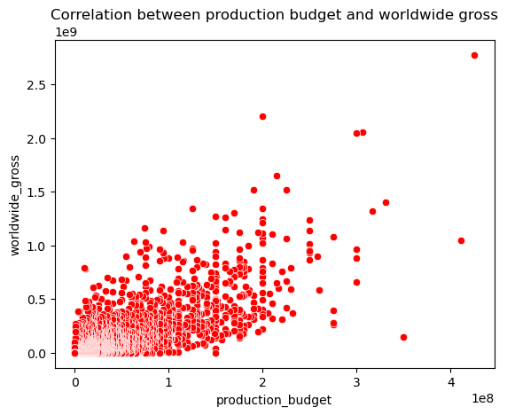
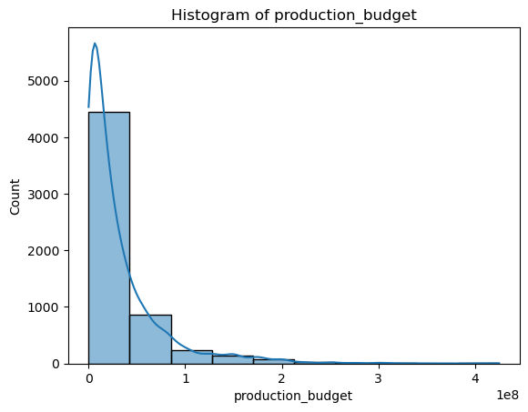
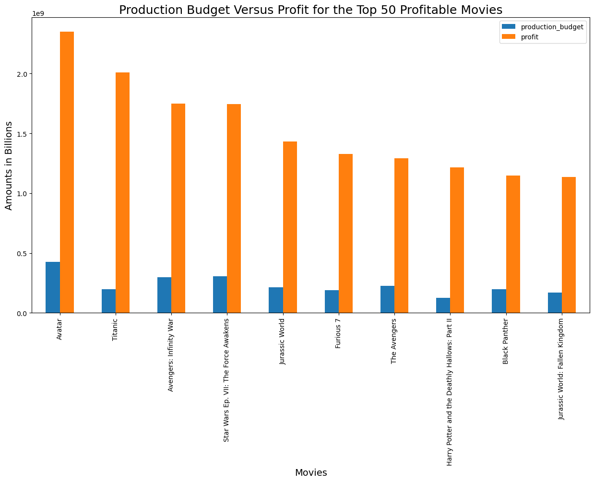
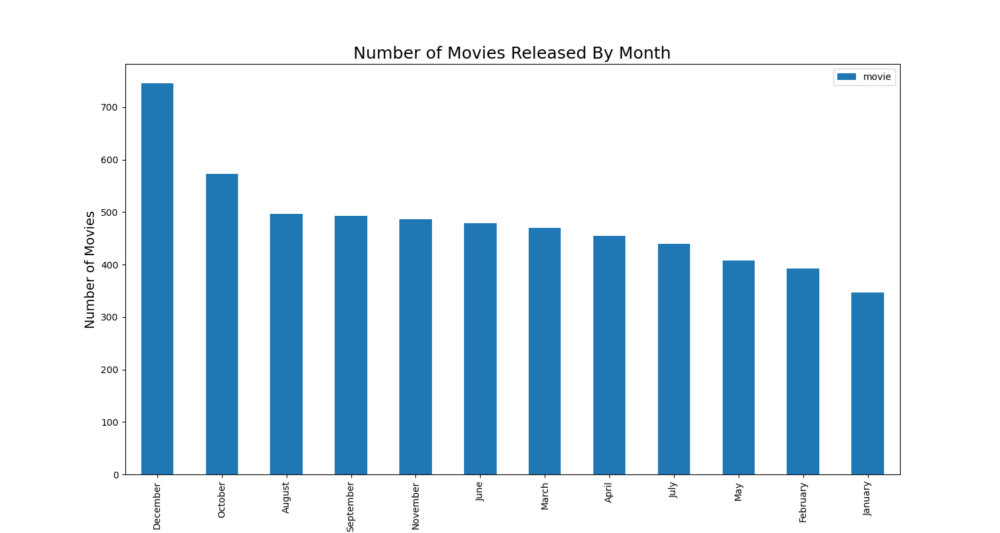
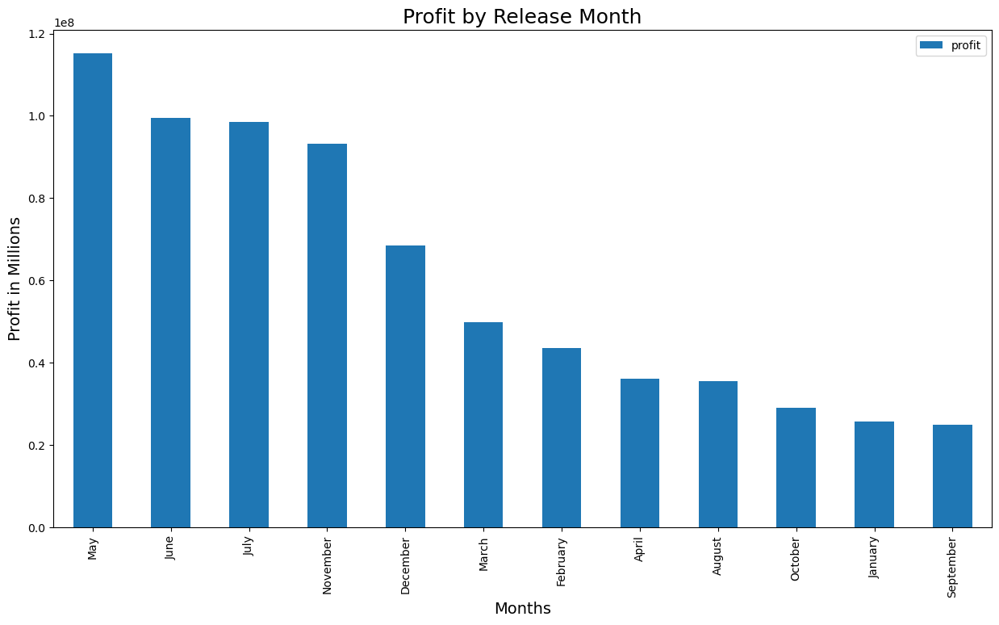
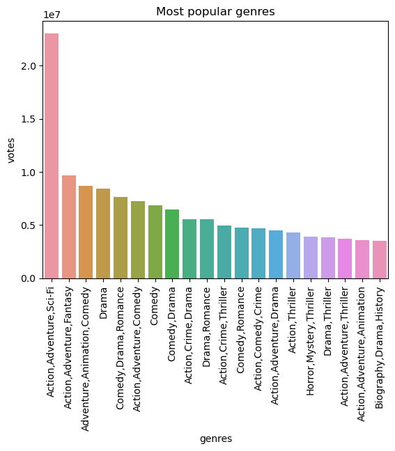
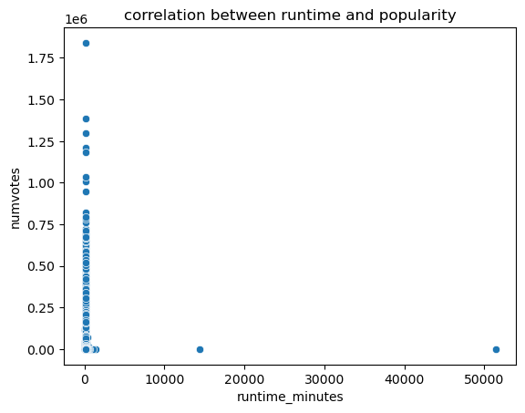
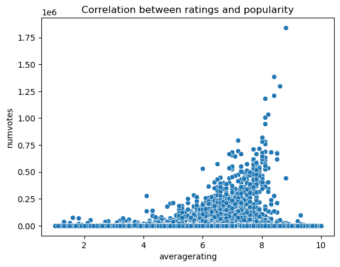

## Project Overview
In this project, I will employ exploratory data analysis to derive valuable insights for a business stakeholder. Our analysis will assess the performance of a movie using the following metrics:
1. Movie Ratings
2. Return on Investment
3. Domestic Gross Revenue
4. Worldwide Gross Revenue
5. Number of Votes
6. Movie Genres
7. Production budget

## Business Understanding
Microsoft is venturing into original video content creation by establishing a new movie studio. Given their lack of experience in this industry, the objective is to make decisions regarding the types of films to produce. To accomplish this, I will gather and process data from various movie datasets, translating the results into actionable insights for the head of Microsoft's new movie studio.

## Data Understanding and Analysis
The information we have is stored within a directory called "zippedData" and originates from several movie aggregation platforms: IMDB, Box Office Mojo, Rotten Tomatoes, TheMovieDB, and The Numbers. The IMDB data comprises movie genres, average ratings, and the number of votes garnered, which we integrated into a consolidated table for comprehensive analysis. Additionally, we examined data from other sources encompassing budgets, domestic and worldwide gross earnings, and release dates.

## Results
I started with the 'tn.movies_budgets.csv' data set 

This scatterplot shows the correlation between the worlwide gross and production budget 

From this, as the production budget increases so does the worldwide gross

The histogram plot visually illustrates how the count of movies is distributed across different production budgets, highlighting that more movies tend to have higher budgets.

I also plotted nother barchart to show how production budget and profit of movies are related. From the bar chart, its evident that Avatar had the highest production budget and still had massive profits from 2009 to 2019.

The bar chart illustrates the number of movie releases per month based on data from 1997 to 2019. December is notably the month with the highest number of movie releases, closely followed by October.

I also noticed that different months had different profits. To visualize the relationship, I used another barchart 

From that we can conclude May, July, and June lead in terms of the profit generated by movies released during those months. 

# 'IM.DB' dataset visualization

I plotted a barchart to see which genres had the most number of votes.

From the above barchart, a combination of Action, Adventure, and Sci-Fi genres enjoys notably higher popularity compared to other genres.

I also checked what is the correlation between runtime and popularity but there was no correlation 

The lastly was the correlation between runtime and popularity. Whereby they were positively correlated.

## Conclusions

Action is the most profitable genre, with Drama and Comedy following closely. I also uncovered a positive relationship between movie budgets and revenues, indicating that higher-budget films generally earned more. Interestingly, movie runtime showed minimal influence on revenue.

May, June, and July have consistently shown the highest profit margins. However, the underlying reasons behind the increased profits during these specific months require deeper investigation.